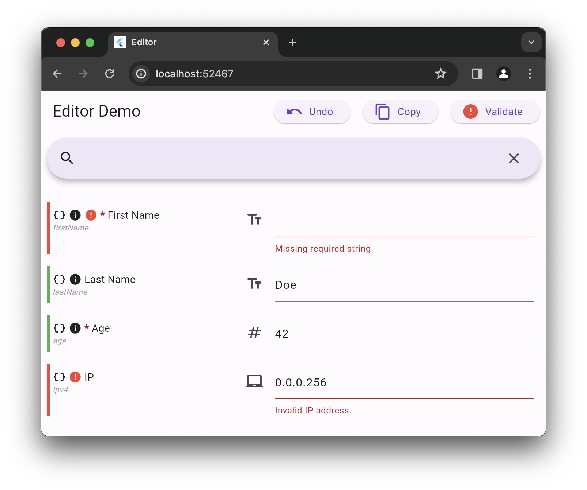

<h1> MOST Key-Value Editor </h1>

  

  

Create highly customizable forms from [JSON Schema](https://json-schema.org/) files.

  

- [Features](#features)
- [Usage](#usage)

## Features

- Highly customizable
- Out-of-the-box support for basic types:
  - booleans
    - `{ "type": "boolean" }`
  - strings
    - `{ "type": "string" }`
  - enums
    - `{ "type": "string", "enumValues": ["a", "b", "c"] }`
  - numbers
    - `{ "type": "number" }`
    - `{ "type": "integer" }`
  - arrays
    - `{ "type": "array", "items": { "type": "string" } }`
- Out-of-the-box validation support
- Feature-rich editor controller
- Built-it search bar for quicker navigation

## Usage
- Create `JsonSchema` object;
- Convert `JsonSchema` into `MostJsonSchema`;
- Add `MostKeyValueEditor` to widget tree `MostJsonSchema` provided!

For more information on the usage, please, check `example/`.
